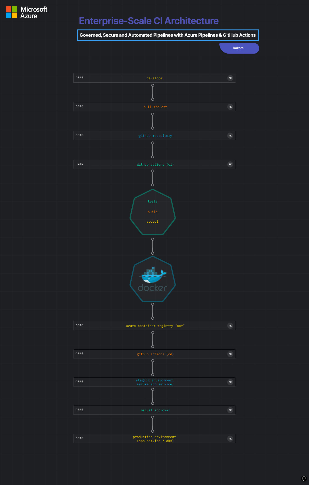

# Enterprise CI/CD Pipeline – GitHub Actions + Azure

Production-grade CI/CD architecture using GitHub Actions, Docker and Azure.

This repository demonstrates how to design, secure and operate modern
continuous integration and deployment pipelines for frontend applications.

---

## Architecture Overview


- **CI**: GitHub Actions
- **CD**: GitHub Actions (Staging / Production environments)
- **Containerization**: Docker
- **Registry**: Azure Container Registry (ACR)
- **Deployment targets**:
  - Azure App Service (containers)
  - AKS (reference architecture)
- **Security**:
  - CodeQL static analysis
  - Secret validation workflows
  - Environment protection rules

---
## Certification Alignment

This repository is aligned with:

- **Microsoft AZ-400 – Designing and Implementing DevOps Solutions**
- CI/CD with **Azure Pipelines** and **GitHub Actions**

Certification proof available in `/certifications`

---

## CI/CD Flow

1. Developer opens a Pull Request
2. CI pipeline runs:
   - Install dependencies
   - Lint
   - Tests
   - Build
3. CodeQL performs security analysis
4. Merge triggers CD:
   - `develop` → Staging
   - `main` → Production
5. Docker image is built and pushed to ACR
6. Application is deployed
7. Health checks validate availability

---

## Security & Governance

- Secrets managed via GitHub encrypted secrets
- No credentials stored in code
- CodeQL scans on every PR and push
- Production environment protected by manual approvals

---

## Repository Structure

```text
.github/workflows/   # CI/CD, security, secret validation
docker/              # Production and development images
scripts/             # Operational automation
azure/               # Cloud architecture documentation
app/sample-app/      # Demo application
diagrams/             # CI/CD architecture diagrams
